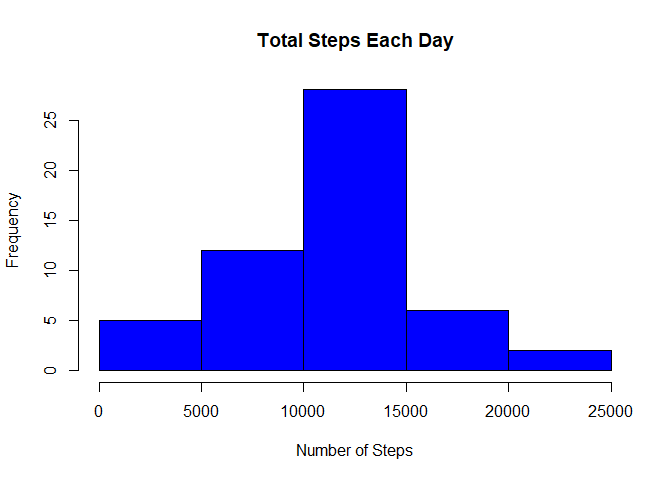

## Loading and preprocessing the data

```r
##Unzip and load data as CS
data <- read.csv(unzip("activity.zip", "activity.csv"))
```

## What is mean total number of steps taken per day?

```r
##Sum steps by day, create Histogram, and calculate mean and median. 
steps_by_day <- aggregate(steps ~ date, data, sum)
hist(steps_by_day$steps, main = paste("Total Steps Each Day"), col="blue", xlab="Number of Steps")
```

<!-- -->

```r
rmean <- mean(steps_by_day$steps)
rmedian <- median(steps_by_day$steps)
```


## What is the average daily activity pattern?


```r
#Calculate average steps for each interval for all days, create Plot, and find interval with most average steps. 
steps_by_interval <- aggregate(steps ~ interval, data, mean)

plot(steps_by_interval$interval,steps_by_interval$steps, type="l", xlab="Interval", ylab="Number of Steps",main="Average Number of Steps per Day by Interval")
```

<!-- -->

```r
max_interval <- steps_by_interval[which.max(steps_by_interval$steps),1]
```

## Imputing missing values

```r
#Find all missing cases and impute missing interval values with average of the interval across all days.  
incomplete <- sum(!complete.cases(data))
imputed_data <- transform(data, steps = ifelse(is.na(data$steps), steps_by_interval$steps[match(data$interval, steps_by_interval$interval)], data$steps))
#Impute day 1 steps to 0.
imputed_data[as.character(imputed_data$date) == "2012-10-01", 1] <- 0

#Recount total steps by day and create Histogram. 
steps_by_day_i <- aggregate(steps ~ date, imputed_data, sum)
hist(steps_by_day_i$steps, main = paste("Total Steps Each Day"), col="blue", xlab="Number of Steps")

#Calculate new mean and median for imputed data. 
rmean.i <- mean(steps_by_day_i$steps)
rmedian.i <- median(steps_by_day_i$steps)

#Calculate difference between imputed and non-imputed data.
mean_diff <- rmean.i - rmean
med_diff <- rmedian.i - rmedian

#Create Histogram to show difference. 
hist(steps_by_day$steps, main = paste("Total Steps Each Day"), col="red", xlab="Number of Steps", add=T)
legend("topright", c("Imputed", "Non-imputed"), col=c("blue", "red"), lwd=10)
```

<!-- -->

```r
#Calculate total difference.
total_diff <- sum(steps_by_day_i$steps) - sum(steps_by_day$steps)
```

## Are there differences in activity patterns between weekdays and weekends?

```r
weekdays <- c("Monday", "Tuesday", "Wednesday", "Thursday", 
              "Friday")
imputed_data$dow = as.factor(ifelse(is.element(weekdays(as.Date(imputed_data$date)),weekdays), "Weekday", "Weekend"))

steps_by_interval_i <- aggregate(steps ~ interval + dow, imputed_data, mean)

library(lattice)

xyplot(steps_by_interval_i$steps ~ steps_by_interval_i$interval|steps_by_interval_i$dow, main="Average Steps per Day by Interval",xlab="Interval", ylab="Steps",layout=c(1,2), type="l")
```

<!-- -->
